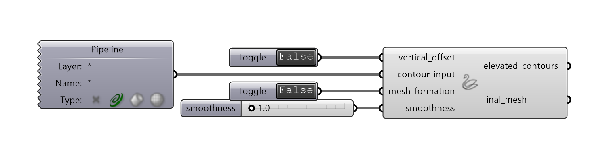
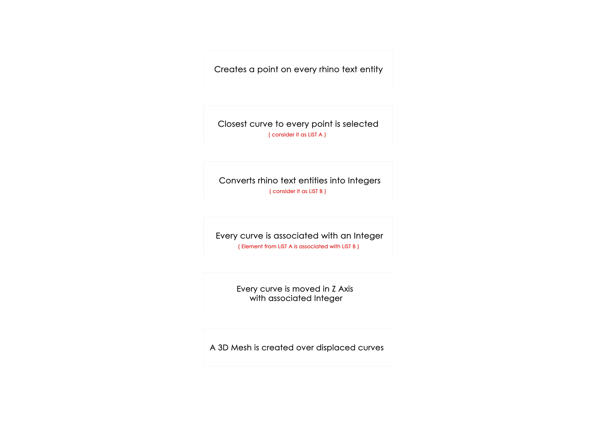

# SWAAN

**SWAAN is a tool that helps you convert your 2D topographic plan into a 3D mesh.**

## INPUTS

* **CONTOUR_INPUT    :** Connect a Geometry Pipeline and right click to set geometry as Curves
* **VERTICAL_OFFSET  :** Connect a Boolean Toggle to displace curves 
* **MESH_FORMATION  :** Connect a Boolean Toggle to create 3D mesh

## HOW IT WORKS

