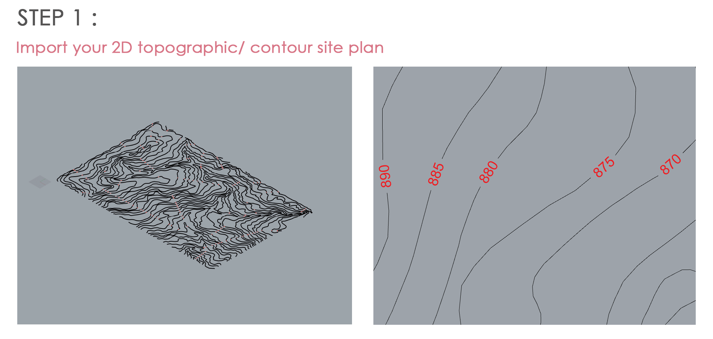
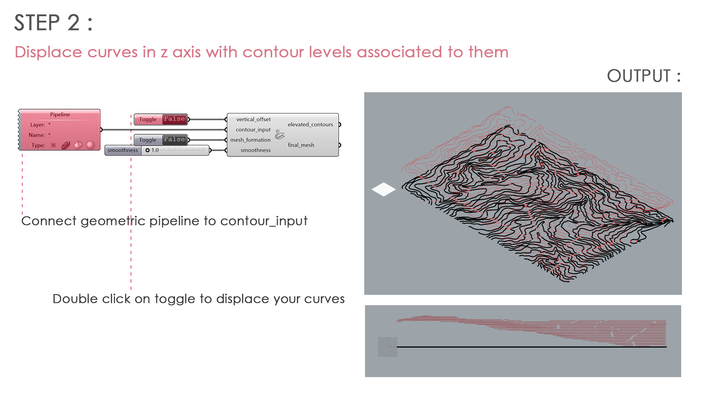
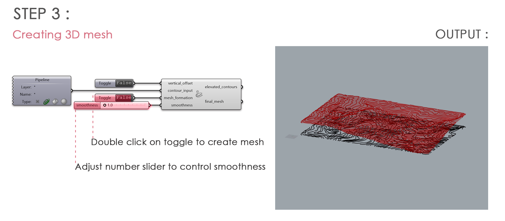
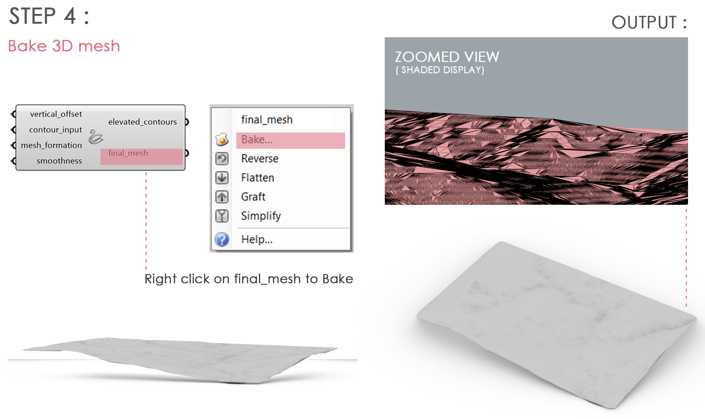

# SWAAN

**SWAAN is a tool that helps you convert your 2D topographic plan into a 3D mesh.**

## INPUTS

* **CONTOUR_INPUT    :** Connect a Geometry Pipeline and right click to set geometry as Curves
* **VERTICAL_OFFSET  :** Connect a Boolean Toggle to displace curves 
* **MESH_FORMATION  :** Connect a Boolean Toggle to create 3D mesh

## HOW TO USE

**Following steps explain how to use the plugin -**

## HOW IT WORKS

**This flowchart explains workflow of code -**

## LICENSE

Copyright (c) 2024 cmadithya

The project 'SWAN' is licensed under the MIT License. For more details, please refer to the [LICENSE](LICENSE) file.

